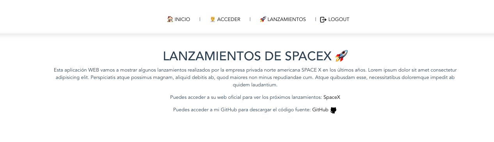

# SpaceX :rocket:

## Lanzar proyecto
Instalar depencias de node
```
yarn install
```
### Lanzar servidor de lanzamientos
```
cd API_launches
json-server -w launches.json
```
### Api de usuarios
He utilizado la API Fake de platzi la documentación está en la siguiente url
[API AUTH](https://fakeapi.platzi.com/en/rest/users/).

### Correr la aplicación en modo desarrollo
```
yarn serve
```

### Imágenas de la aplicación




